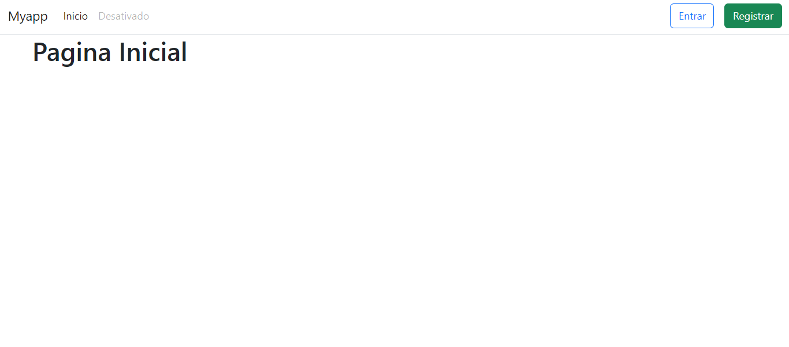
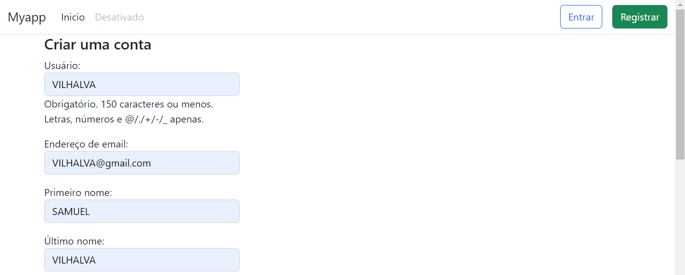
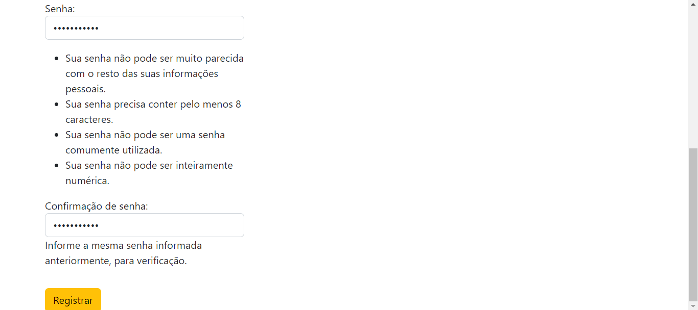
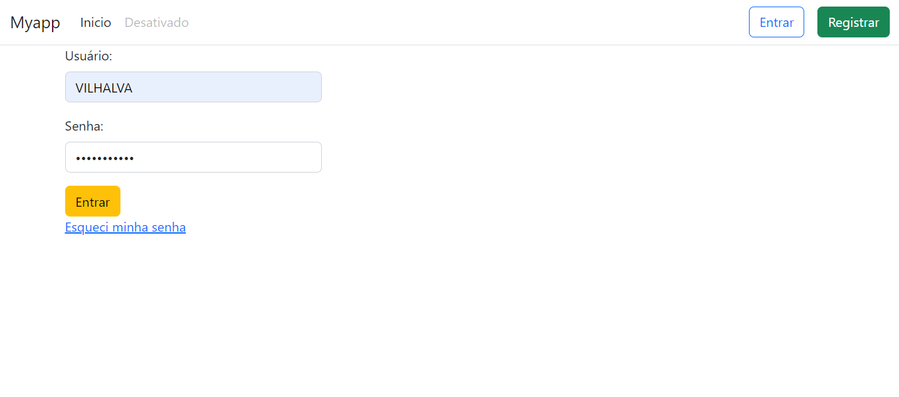
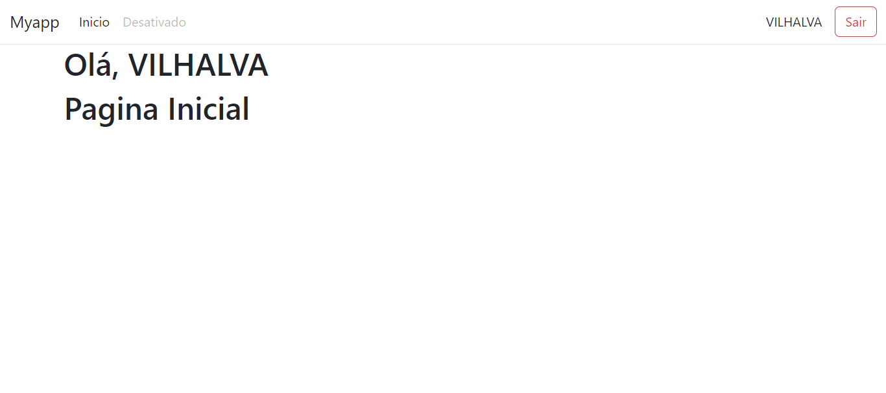
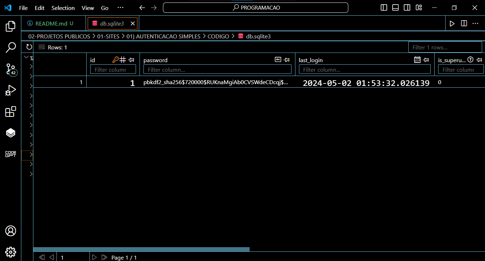
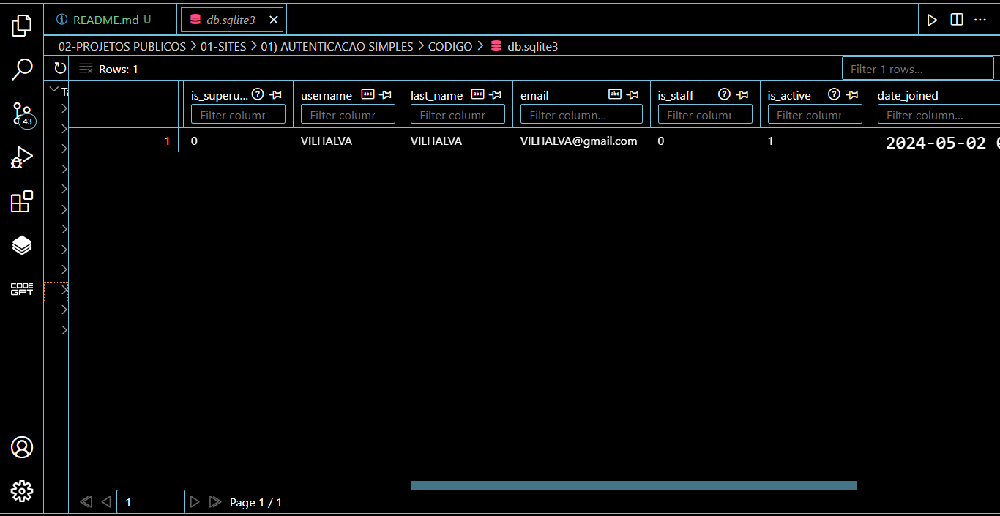
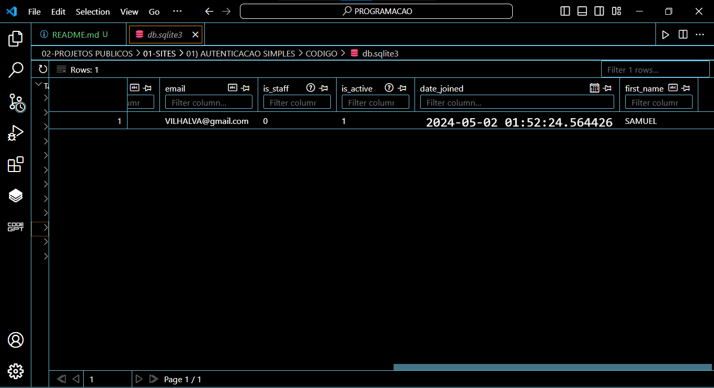

# AUTENTICACAO SIMPLES
👨‍🏫FORMULÁRIO DE LOGIN E CADASTRO COM DJANGO E SQLITE!

 <br>
 <br>
 <br>
 <br>
 <br>
 <br>
 <br>
 <br>

## DESCRIÇÃO:
- Esse aplicativo fornece uma maneira simples para os usuários se registrarem, fazerem login, alterarem suas senhas e redefinirem senhas esquecidas em um site construído com Django. Ele utiliza as funcionalidades padrão de autenticação fornecidas pelo Django, permitindo que os usuários acessem facilmente esses recursos sem a necessidade de implementar muita customização ou complexidade.

- Essencialmente, esse aplicativo oferece uma experiência de autenticação simples e direta para os usuários, sem exigir muita interação com o desenvolvedor ou administração do sistema.

## PERMISSÃO:
Em termos simples, os usuários podem:

1. **Registrar-se**: Criar uma nova conta no site, fornecendo um nome de usuário, endereço de e-mail e senha.
   
2. **Fazer login**: Acessar suas contas existentes digitando seus nomes de usuário e senhas.

3. **Alterar senha**: Atualizar suas senhas existentes, caso desejem uma senha mais forte ou se esqueçam dela.

4. **Redefinir senha**: Recuperar o acesso à conta se esquecerem suas senhas atuais, seguindo um processo de redefinição de senha por e-mail.

## EXECUTANDO O PROJETO:
1. **Aplicando migrações pendentes:**
   - Antes de executar o aplicativo Django, é importante garantir que todas as migrações pendentes tenham sido aplicadas ao banco de dados. Para isso, utilize o comando a seguir no terminal, estando no diretório raiz do projeto Django, onde o arquivo `manage.py` está localizado:
   ```bash
   python manage.py migrate
   ```
   Este comando aplicará todas as migrações pendentes ao banco de dados, garantindo que o esquema do banco de dados esteja sincronizado com as alterações nos modelos de dados do seu aplicativo Django.

2. **Instalando as dependências:**
   - Antes de executar o aplicativo, certifique-se de instalar todas as dependências necessárias. No terminal, execute o seguinte comando para instalar as dependências listadas no arquivo `requirements.txt` no diretório: `CODIGO`:
   ```bash
   pip install -r requirements.txt
   ```

3. **Executando o Aplicativo:**
   - Em seguida, execute o seguinte comando para iniciar o servidor Django:
   ```bash
   python manage.py runserver
   ```
   - Uma vez que o servidor esteja em execução, você poderá acessar o aplicativo através do seu navegador, visitando o seguinte endereço: `http://localhost:8000/`.

4. **Usando o APP**:
   1. **Acessando a Página Inicial**:
      - Ao abrir o aplicativo no navegador, você será direcionado para a página inicial automaticamente.
      - Na barra de navegação no topo da página, você verá links para as diferentes partes do aplicativo, como "Início", "Entrar", "Registrar" e "Esqueci minha senha".

   2. **Login**:
      - Se você já tem uma conta, clique no botão "Entrar" na barra de navegação.
      - Você será redirecionado para a página de login, onde poderá inserir seu nome de usuário e senha.
      - Após inserir suas credenciais corretamente, clique no botão "Entrar" para fazer login na sua conta.

   3. **Registro**:
      - Se você ainda não tem uma conta, clique no botão "Registrar" na barra de navegação.
      - Você será levado para a página de registro, onde poderá preencher um formulário com informações como nome de usuário, e-mail e senha.
      - Após preencher o formulário corretamente, clique no botão "Registrar" para criar sua conta.

   4. **Redefinição de Senha**:
      - Se você esqueceu sua senha, clique no link "Esqueci minha senha" na página de login.
      - Você será redirecionado para a página de redefinição de senha, onde poderá inserir o endereço de e-mail associado à sua conta.
      - Após inserir seu e-mail, clique no botão "Resetar" para receber um e-mail com instruções para redefinir sua senha.

   5. **Logout**:
      - Quando desejar sair da sua conta, clique no botão "Sair" na barra de navegação.
      - Isso fará com que você seja desconectado da sua conta e redirecionado de volta para a página inicial.

## TECNOLOGIAS USADAS:
- [**PYTHON**:](https://github.com/VILHALVA/CURSO-DE-PYTHON) Python é uma linguagem de Programação.
- [**DJANGO:**](https://github.com/VILHALVA/CURSO-DE-DJANGO) Framework de aplicativo da web em Python.
- [**SQLITE:**](https://github.com/VILHALVA/CURSO-DE-SQLITE) Sistema de gerenciamento de banco de dados relacional.
- [**PYTHON COM SQLITE**:](https://github.com/VILHALVA/CURSO-DE-PYTHON-COM-SQLITE) Python é uma linguagem de Programação, enquanto SQLite é um banco de dados.
- [**BOOTSTRAP:**](https://github.com/VILHALVA/CURSO-DE-BOOTSTRAP) Biblioteca de CSS para facilitar o desenvolvimento do layout e design responsivo da interface do usuário.
   
## CREDITOS:
- [PROJETO CRIADO PELO "codloom"](https://github.com/codloom/DjangoAutenticacaoSimples)
- [VEJA O VIDEO DESSE PROJETO](https://youtu.be/ZqckdX-tkEg?si=-ZeYp1BV30HOEjqK)
- [PROJETO EDITADO PELO VILHALVA](https://github.com/VILHALVA)
- [VEJA O MANUAL](./MANUAL.md)

